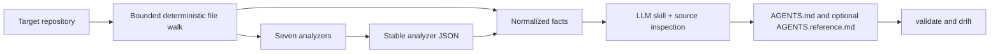

# Architecture

agentskill is a Rust evidence tool and an LLM skill. The Rust side discovers
facts that tools can verify; the skill turns those facts, source inspection, and
maintainer answers into useful repository guidance. The Rust CLI never writes
semantic Markdown.

## System Boundary

The target repository is read, bounded, and never modified by an analyzer run.
The supported target-language matrix remains owned by the language registry.
The filesystem walker excludes dependency, cache, build, and generated trees,
sorts paths deterministically, classifies file roles, and caps file count and
text reads.

```text
agentskill-core/
  errors, language registry, filesystem snapshots, document parsing, output
agentskill-analyzers/
  scan, measure, config, git, graph, symbols, tests, normalized evidence
agentskill-generation/  (package: agentskill-validation)
  read-only AGENTS.md validation and drift checks
agentskill/
  Clap parsing, dispatch, JSON output, agentskill/agsk binaries
agentskill-skill/
  LLM workflow, output contract, references, and examples
```

Dependencies point inward: the CLI depends on analyzer and validation
libraries, analyzers depend on core, and the skill consumes the CLI contract.
The physical `agentskill-generation/` path is retained for source-layout
compatibility; its published crate name is `agentskill-validation`.

## Evidence Flow



The `analyze` command remains the broad raw analyzer contract. `evidence` is
the synthesis contract and includes:

```json
{
  "schema_version": 3,
  "repository": {"root": "...", "revision": "...", "dirty": false},
  "facts": [
    {
      "id": "test.command.1",
      "category": "command",
      "scope": "repository",
      "value": "cargo test --workspace --locked",
      "confidence": "verified",
      "evidence": [{"path": "Makefile"}]
    }
  ],
  "analyzers": {}
}
```

Every normalized fact has an identifier, scope, confidence, and provenance.
Facts should be compact and actionable: inventories, tools, commands, test
topology, language roles, and architectural boundaries. Raw analyzer output is
retained for deeper inspection, not copied into Markdown.

## Crate Responsibilities

### Core

`agentskill-core::fs` owns bounded repository walking and `RepoFile` metadata,
including source, test, example, documentation, generated, configuration, and
auxiliary roles. `language` is the source of truth for language and test-path
detection. `document` parses headings for validation; it is not a generation
engine. `output` owns stable JSON serialization and safe output paths.

### Analyzers

Each analyzer exposes a tolerant `run` function returning structured JSON or a
structured error. The aggregate runner dispatches the fixed registry in
parallel and inserts results in stable key order. The evidence adapter adds
normalized facts without changing the established analyzer keys.

| Analyzer | Primary signal |
| --- | --- |
| `scan` | tree, inventory, languages, read order |
| `measure` | indentation, line lengths, whitespace |
| `config` | formatters, linters, type checkers, project markers |
| `git` | history, branches, commit conventions |
| `graph` | internal imports, cycles, package boundaries |
| `symbols` | declarations and naming patterns |
| `tests` | frameworks, mappings, fixtures, commands |

### Validation

`agentskill-validation` does not infer or render repository rules. `validate`
checks that the LLM-authored documents exist, have unique headings, contain
valid local references, end cleanly, and keep the operational file within its
budget. `drift` reruns evidence, captures the current revision, and reports
broken paths in both documents. Both operations are read-only.

## LLM Document Contract

The skill owns `init`, `enrich`, `scope`, `context`, `update`, and `audit`.
`operational` and `reference` are depth views of one understanding, not two
independent generations.

The root `AGENTS.md` is normally 500–1,000 tokens and has a hard warning or
failure threshold at 1,500. It should contain mission/map, non-negotiables,
conceptual don'ts, quick-start commands, change routing, architecture,
implementation/testing rules, and a few high-value playbooks. Rules must be
source-backed or explicitly supplied by a maintainer. If a reference file
exists, the root links to `AGENTS.reference.md` and remains useful without it.

The reference document has no equivalent compact budget. It may contain deep
architecture, rationale, ownership, workflows, examples, history, uncertainty,
and evidence details. The skill should load it selectively; very large context
may be split into topic files while keeping the root index compact.

There are no Rust-side profiles, layouts, reference loaders, interactive
prompts, or feedback sidecars. The LLM decides whether to create or update the root and
reference views after comparing evidence with direct source inspection.

## CLI Contracts

```text
agentskill <command> ...
agsk       <command> ...
```

Public commands are `analyze`, `evidence`, `scan`, `measure`, `config`, `git`,
`graph`, `symbols`, `tests`, `validate`, and `drift`. JSON commands support
`--pretty` and safe relative `--out FILE`. Analyzer failures are JSON payloads
with a failed status; invalid arguments and unusable paths are process errors.

## Testing And Extension

Changes to analyzer keys, evidence fields, language detection, roles, command
flags, or validation semantics require contract tests and documentation.
Fixtures under `agentskill-skill/examples/` cover target languages and document
shapes. Keep analyzer logic in `agentskill-analyzers`, shared behavior in core,
validation in its owning crate, and the CLI entrypoint thin.

Adding a language updates the registry, representative fixture, applicable
analyzer tests, documentation, and release matrix coverage. Adding an analyzer
updates the registry, dispatch, evidence mapping when relevant, tests, and CLI
documentation.

## Release Architecture

Numeric `X.Y.Z` and `X.Y.Z-rc.N` tags drive verified GitHub Actions releases.
Archives contain both binaries and `LICENSE`; `SHA256SUMS` is required. `VERSION`
and the workspace version are `2.1.0` for this refactor. Locked checks, archive
verification, and release-note extraction remain mandatory.
