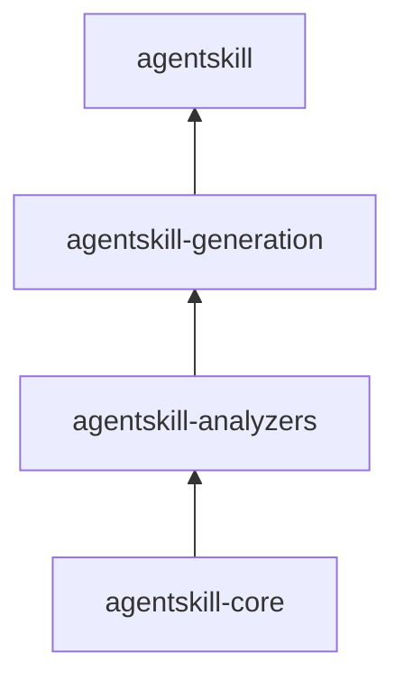
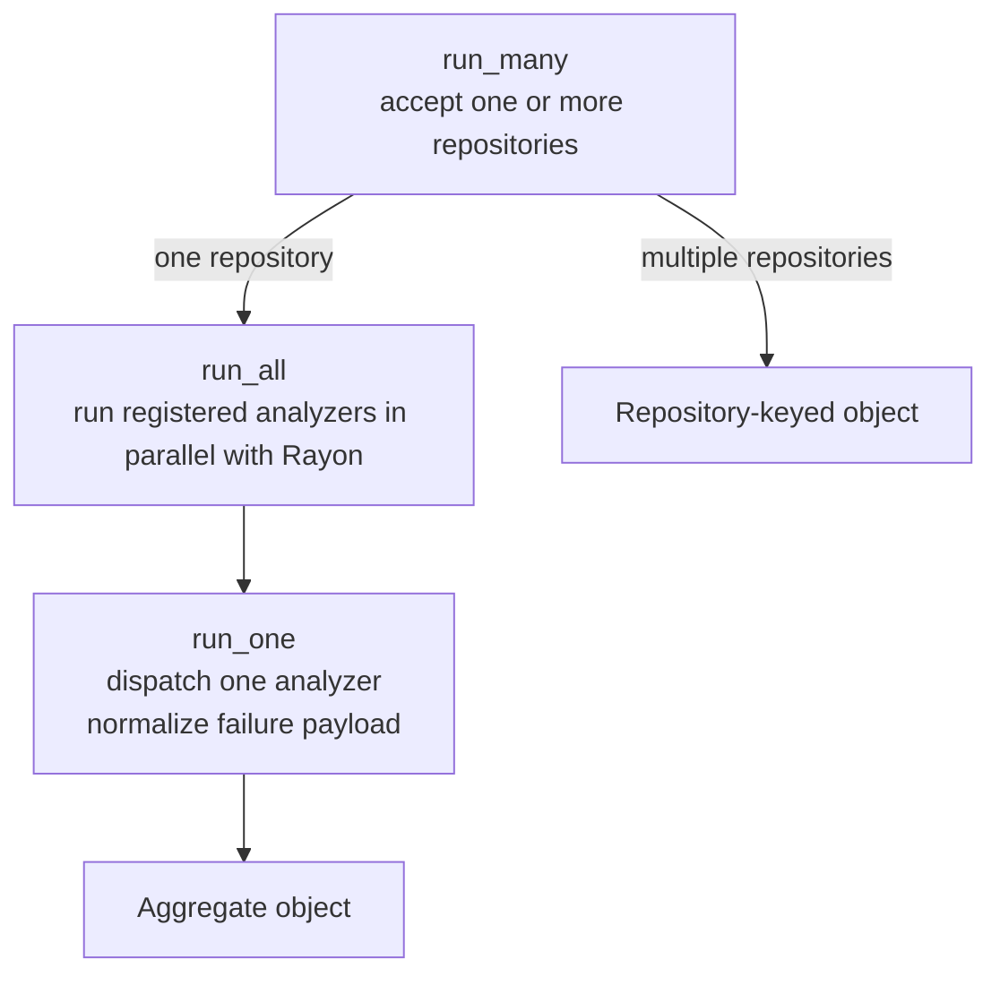
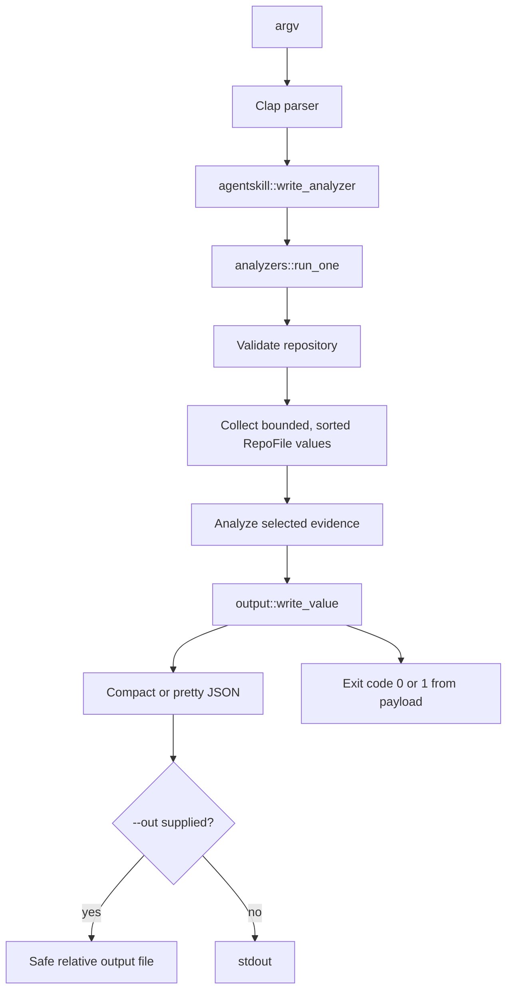
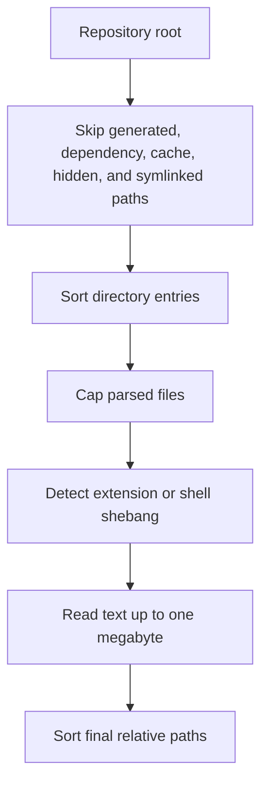
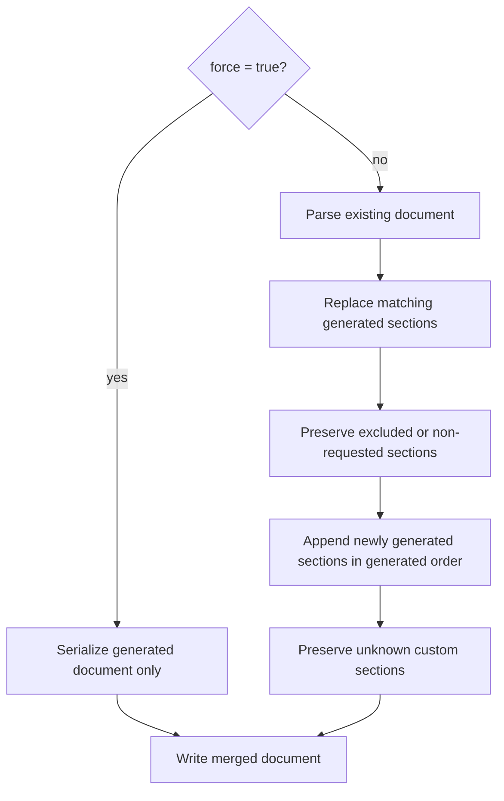
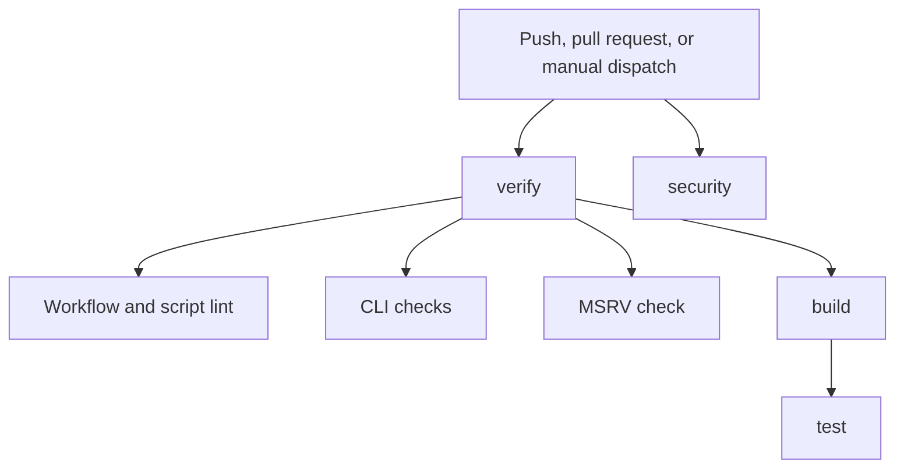
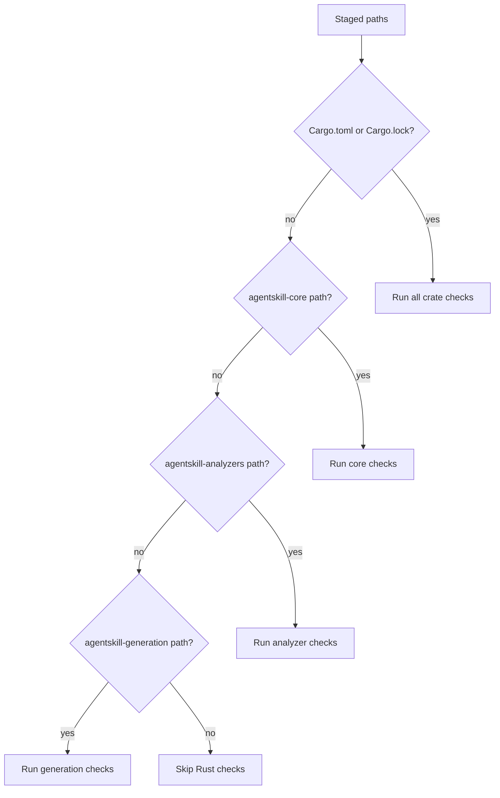
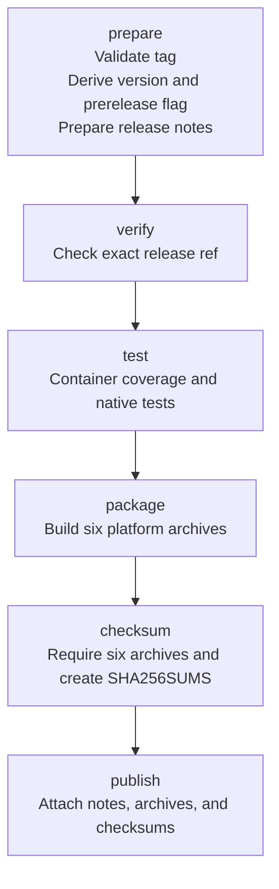

# Architecture

This document describes the technical architecture of `agentskill` v2. It is
the implementation map for contributors who need to understand where evidence
comes from, how it moves through the system, how markdown is produced, and how
the release automation turns a Git tag into portable binaries.

## System Boundary

`agentskill` analyzes a target repository. The target repository is data: it is
walked, read, and inspected, but it is not compiled or modified during an
analyzer run. Generation and update are the two intentional write workflows.

The project itself is a Rust workspace. The repositories it analyzes can use
the supported target-language matrix:

```text
Python · TypeScript · JavaScript · Go · Rust · Java · Kotlin · C# · C
C++ · Ruby · PHP · Swift · Objective-C · Bash
```

The implementation has four runtime crates and four repository-support areas:

```text
Workspace Runtime
├── agentskill-core
│   └── shared domain types, filesystem access, language registry,
│       documents, references, errors, and JSON output
├── agentskill-analyzers
│   └── scan, measure, config, git, graph, symbols, tests, and aggregation
├── agentskill-generation
│   └── AGENTS.md rendering, profiles, layouts, references, feedback, and merge
└── agentskill
    └── Clap command parsing and the agentskill/agsk binaries

Repository Support
├── agentskill-docs
│   └── user-facing CLI and architecture documentation
├── agentskill-scripts
│   └── pre-commit, release-note, and release-archive helpers
├── agentskill-skill
│   └── packaged skill instructions, synthesis contract, references, examples
└── agentskill-tests
    └── compatibility contract fixtures and configuration fixtures
```

The dependency direction is deliberately one-way:



`agentskill-core` does not depend on analyzer or generation code. This keeps
the shared data and safety rules reusable and makes each layer independently
testable.

## Crate Responsibilities

### `agentskill-core`

The core crate owns behavior that must be consistent across every analyzer and
generation flow.

| Module | Responsibility |
| --- | --- |
| `error` | `AgentskillError`, `Result`, path validation, and public error payloads |
| `fs` | bounded text reads, deterministic repository walking, file metadata, and line counts |
| `language` | supported-language registry, extension/shebang detection, and test-path detection |
| `document` | markdown heading parsing, section normalization, serialization, and merge semantics |
| `reference` | local/remote reference validation, loading, and commit metadata |
| `output` | compact/pretty JSON formatting, safe output paths, and file/stdout writing |
| `lib` | public module exports |

The core layer is intentionally tolerant at repository boundaries. Unreadable
files are skipped or represented as empty text where continuing the scan gives
more useful output than aborting. Invalid user arguments and invalid repository
paths remain explicit errors.

### `agentskill-analyzers`

The analyzer crate converts a repository into structured evidence. Every public
analyzer has the same broad contract:

```rust
pub fn run(repo: &str, options: ...) -> agentskill_core::Result<serde_json::Value>
```

The CLI boundary converts an error into the stable shape below:

```json
{
  "error": "not a directory: ./missing",
  "script": "scan"
}
```

The modules are intentionally data-oriented instead of sharing a large class
hierarchy. Each analyzer reads the common `RepoFile` representation and emits
the JSON structure best suited to its evidence.

| Analyzer | Evidence Produced |
| --- | --- |
| `scan` | file tree, source-file inventory, language totals, entrypoint/read-order signals |
| `measure` | indentation, line-length distributions, blank-line patterns, trailing whitespace, newline presence |
| `config` | formatter, linter, type-checker, project-marker, editorconfig, and tool settings |
| `git` | commit subjects, conventional prefixes, branches, merge signals, and repository history |
| `graph` | internal import edges, module resolution, cycles, dependency concentration, and monorepo boundaries |
| `symbols` | functions, classes/types, constants, language-specific categories, naming patterns, and precision summaries |
| `tests` | framework detection, test/source counts, test naming, mappings, fixtures, and run commands |

The aggregate runner exposes two levels:



The analyzer registry lives in `agentskill-core::output::ANALYZER_NAMES` and is
used by aggregation and contract tests. Adding a public analyzer requires
updating the registry, dispatch, documentation, and tests together.

### `agentskill-generation`

The generation crate consumes one aggregate analysis value and turns it into a
sectioned `Document`. It owns no analyzer-specific parsing; it reads facts from
the aggregate JSON and renders them into stable, title-cased sections.

The generation pipeline is:

```mermaid
flowchart TD
    validate[Validate repository, profile, and layout]
    inputs[Load references and feedback]
    analyze[run_all(repository)]
    render[Render ordered sections]
    enrich[Apply interactive answers<br/>Apply feedback notes<br/>Attach reference metadata]
    output[Serialize or merge markdown]
    write[Write output files or print stdout]

    validate --> inputs --> analyze --> render --> enrich --> output --> write
```

Generation and update have different semantics:

| Flow | Existing `AGENTS.md` | Custom Sections | Writes By Default |
| --- | --- | --- | --- |
| `generate` | ignored | not merged | stdout |
| `update` | used as merge input | preserved unless forced/filtered | repository `AGENTS.md` |

`update` uses normalized section names. Number prefixes, case, and repeated
whitespace do not affect matching, so `Testing`, `12. Testing`, and
`## 12. Testing` identify the same logical section.

### `agentskill`

The application crate is intentionally thin. It contains:

1. Clap structs describing the public command surface.
2. Dispatch from parsed commands to library functions.
3. JSON output for analyzers.
4. Exit-code conversion at the process boundary.
5. The two binary targets, `agentskill` and `agsk`.

Analyzer implementation does not belong in this crate. This keeps direct Rust
callers and tests independent of command-line parsing.

## Command Data Flow

### Analyzer Commands

The single-analyzer path is:



`analyze` calls `run_many` and preserves the aggregate object shape. It also
validates every requested reference before analysis. Single-analyzer errors
are emitted as JSON and return a failed process status, allowing both humans
and automation to inspect the failure without parsing stderr.

### Repository Walking

Repository traversal is centralized in `agentskill-core::fs`:



The walker records both the physical byte size and newline-based line count.
Text analyzers use bounded lossy UTF-8 reads, while binary-like or unsupported
files remain in the inventory only when they can be classified meaningfully.

This centralization prevents analyzers from disagreeing about hidden folders,
file ordering, limits, and language detection.

### Language Detection

The language registry is the single source of truth for:

- language identifiers and display names;
- recognized extensions;
- extensionless Bash/shebang detection;
- language-specific test filename patterns; and
- test-directory names such as `tests`, `spec`, and `__tests__`.

Case-insensitive extension matching is used so `MAIN.RS` and `main.rs` follow
the same path. Objective-C headers receive a content-aware distinction when a
header contains an `@interface` declaration.

## Analyzer Internals

### Scan

`scan` aggregates `RepoFile` values by language and reports a deterministic
tree. Entrypoints receive priority in read-order evidence, followed by line
count and path ordering. Unsupported files do not become false language
signals.

### Measure

`measure` operates on source text without rewriting it. It records:

- tab and space indentation evidence;
- mixed-indentation files;
- p50, p75, p95, p99, and maximum nonblank line lengths;
- language-specific blank-line distributions;
- missing or present final newlines; and
- files containing trailing whitespace.

Empty populations are represented with stable empty structures rather than
fabricated measurements.

### Config

`config` detects configuration from bounded TOML, YAML, JSON, INI, and
EditorConfig-like files. It keeps configuration-only projects visible even
when they contain no recognized source file. Nested project markers are found
recursively, while public marker values remain relative basenames for contract
compatibility.

### Git

`git` is the only analyzer that invokes an external repository command. It
degrades to structured error information when history is unavailable, while
preserving successful commit, branch, prefix, and merge evidence.

### Graph

`graph` builds a language-aware module index and resolves internal edges only.
External package names are ignored. The resolver handles relative imports,
index modules, JavaScript/TypeScript re-exports, Go module prefixes, Swift
module roots, and monorepo boundary directories.

Graph output is bounded:

```text
internal edges  ≤ 200
reported cycles ≤ 20
most-depended   ≤ 10
```

Cycles are emitted as closed paths with the starting module repeated. This is
useful to callers because the final edge is explicit instead of implied.

### Symbols

`symbols` strips comments before extracting declarations. It preserves C/C++
preprocessor directives, recognizes language-specific declarations, and keeps
file names as normalized stems. Pattern summaries are deterministic and
percentages are rounded to one decimal place.

### Tests

`tests` divides files into source and test sets using the shared language
registry, detects framework signals, infers commands from Makefiles and
package manifests, and maps test stems back to source stems. It reports
unmatched tests and untested sources rather than hiding mapping gaps.

## Document Model And Merge Semantics

Markdown is represented as:

```rust
Document {
    preamble: String,
    sections: Vec<Section>,
}

Section {
    level: usize,
    heading: String,
    body: String,
}
```

The parser recognizes ATX headings with up to three leading spaces, supports
heading levels one through six, and treats an initial `# AGENTS.md` or
`# Agents` line as preamble rather than a generated section.

The merge algorithm is ordered and conservative:



`--section` limits replacement to named sections. `--exclude-section` prevents
replacement and appending for named sections. Feedback-preserved sections are
added to the effective exclusion set during normal update mode and ignored by
forced rebuilds.

## Profiles And Layouts

Profiles control information density:

| Profile | Meaning |
| --- | --- |
| `concise` | compact operational guidance for normal agent context |
| `comprehensive` | the same evidence with expanded verification guidance |

Layouts control packaging, not facts:

| Layout | Output |
| --- | --- |
| `single` | one `AGENTS.md` document, or stdout when no `--out` is supplied |
| `split` | concise primary document plus `AGENTS.reference.md` |
| `multifile` | root index plus numbered files under `.agentskill/` |

The same aggregate analysis feeds every profile and layout. This is important:
changing presentation must not silently change the repository facts used to
write guidance.

`update` currently supports the `single` layout because section merge semantics
are defined for one canonical document. Unsupported combinations fail with a
targeted argument error instead of silently producing a different layout.

## References And Interactive Generation

References can be local repository paths or Git URLs. Local references require
a nonempty `AGENTS.md`. Remote references are shallow-cloned into a temporary
directory, have a bounded clone wait, and record the resolved commit SHA when
available.

Reference metadata is embedded in generated output as a machine-readable HTML
comment:

```text
<!-- agentskill-metadata
{
  "agentskill_version": "2.0.0",
  "references": [
    {
      "kind": "local",
      "value": "...",
      "source_path": "AGENTS.md"
    }
  ]
}
-->
```

References are validated for duplicate identity before analysis. Local paths
are canonicalized for identity; remote URLs use their supplied identity.

Interactive generation first uses detected evidence. When a canonical test
command or Git convention is missing, it can infer a value from reference
markdown or ask the operator. Answers are inserted as explicit notes in the
affected generated sections, so inferred or human-supplied information remains
visible rather than becoming hidden state.

## Feedback Sidecar

Update reads an optional repository-local `.agentskill-feedback.json` file.
Its supported shape is:

```json
{
  "preserve_sections": ["Git"],
  "sections": {
    "Testing": {
      "prepend_notes": ["Keep integration tests fast."],
      "pinned_facts": ["The test command is cargo test."]
    }
  }
}
```

The loader validates object and list shapes, normalizes section names, rejects
duplicate names after normalization, and returns actionable errors. Notes and
pinned facts are rendered before regenerated section content. Preserved
sections affect normal update mode but do not survive `--force`.

## CLI And Process Contracts

Both binaries are equivalent:

```text
agentskill <command> ...
agsk       <command> ...
```

The public analyzer commands are:

```text
analyze  scan  measure  config  git  graph  symbols  tests
```

The document commands are:

```text
generate  update
```

Analyzer commands support structured JSON output, `--pretty`, and safe
relative `--out FILE` paths. Document commands produce markdown and reject
`--pretty` because pretty JSON has no meaning for markdown.

The process boundary follows these rules:

| Condition | Output | Exit Status |
| --- | --- | --- |
| successful analyzer | JSON result | `0` |
| analyzer-level failure | `{ "error": ..., "script": ... }` JSON | `1` |
| invalid document argument or write failure | diagnostic on stderr | `1` |
| successful generation/update | markdown file or stdout | `0` |

## CI And Release Architecture

### Verification Workflow

The main workflow composes reusable workflows:



Rust Linux jobs run in the disposable `rust:1.89-bookworm` container. The
coverage job uses the same container and enforces at least 80% line coverage.
Native workspace tests run on `ubuntu-latest`, `macos-latest`, and
`windows-latest`.

Workflow and shell validation runs Actionlint and ShellCheck. The repository’s
local verification equivalent is:

```bash
make verify
```

The concise Make targets are `build`, `check`, `coverage`, `fmt`, `lint`,
`security`, `test`, `verify`, and `workflows`.

### Pre-Commit Workflow

`lefthook.yml` invokes `agentskill-scripts/pre-commit.sh` with staged paths.
The script maps paths to affected crates:



For selected crates it runs formatting, clippy, and tests. If the installed
`rustc` is missing or older than Rust 1.89, it re-executes itself inside a
disposable Rust container with the repository mounted and the current user ID
preserved. This gives local hooks a reproducible fallback without modifying
the host toolchain.

### Release Workflow

Release is tag-driven and supports stable and release-candidate tags:

```text
X.Y.Z       stable release
X.Y.Z-rc.N  prerelease candidate
```

The reusable release stages are:



The package matrix covers:

| Platform | Target |
| --- | --- |
| Ubuntu x86 | `x86_64-unknown-linux-gnu` |
| Ubuntu ARM | `aarch64-unknown-linux-gnu` |
| macOS Intel | `x86_64-apple-darwin` |
| macOS ARM | `aarch64-apple-darwin` |
| Windows x86 | `x86_64-pc-windows-msvc` |
| Windows ARM | `aarch64-pc-windows-msvc` |

Each archive contains both `agentskill` and `agsk` plus `LICENSE`. Packaging
smoke-tests both binaries, validates archive contents, and publishes checksums
before the release action is allowed to run.

Stable release notes are extracted from the matching `CHANGELOG.md` heading.
RC releases receive generated notes that point operators to the final stable
release notes. The release helper rejects tags that do not match either
supported form.

## Extension Guide

### Adding A Language

1. Add one `LanguageSpec` entry to the core registry.
2. Add representative files under `agentskill-skill/examples/<language>`.
3. Extend analyzer-specific parsing only where the language needs it.
4. Add contract coverage for scan, measure, config, graph, symbols, and tests
   behavior that applies to the language.
5. Update the supported-language documentation and release matrix test.

The registry should remain the source of truth; do not duplicate extension or
test-path lists inside individual analyzers.

### Adding An Analyzer

1. Add a module under `agentskill-analyzers/src/`.
2. Expose it from the analyzer crate.
3. Add its name to the analyzer registry and `run_one` dispatch.
4. Define stable success and error JSON shapes.
5. Add analyzer contract tests and include its evidence in generation only when
   the evidence is available.
6. Document the command in `agentskill-docs/cli.md` and `README.md`.

### Changing Generated Markdown

Generated headings, section order, metadata, and merge behavior are public
contracts. Update the generation tests, document the behavior, and verify all
three layouts. Keep evidence extraction in analyzers and rendering decisions
in generation; do not parse source files from markdown rendering code.

### Changing Release Behavior

Keep tag parsing in `agentskill-scripts/release-notes.sh`, archive validation in
`agentskill-scripts/verify-release-archive.sh`, and orchestration in reusable
workflow files. Any change to platform targets must update the package matrix,
the checksum archive count, smoke tests, and release documentation together.

## Design Principles

The architecture favors a small number of explicit patterns:

- **Layering:** dependencies point toward stable shared primitives.
- **Registry and dispatch:** fixed public commands and languages have one
  discoverable registration path.
- **Pipeline composition:** scan evidence flows into analyzers, then into
  generation and serialization.
- **Strategy by data:** profiles and layouts change presentation while sharing
  the same facts.
- **Boundary adapters:** CLI, pre-commit, release scripts, and GitHub Actions
  adapt external process conventions to stable Rust library contracts.
- **Deterministic processing:** sorted inputs and bounded outputs make results
  reproducible and reviewable.
- **Explicit failure handling:** expected repository failures become structured
  results; invalid operator input remains a clear process error.

The code does not introduce traits, factories, or object hierarchies merely to
match a design-pattern catalog. A direct function and a `match` are preferred
when they make the control flow easier to inspect and preserve the same
contract.
